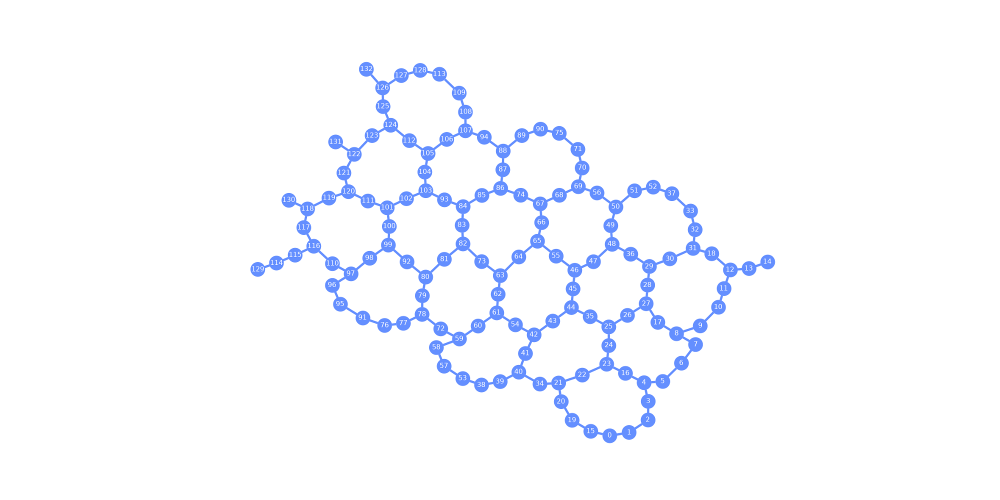
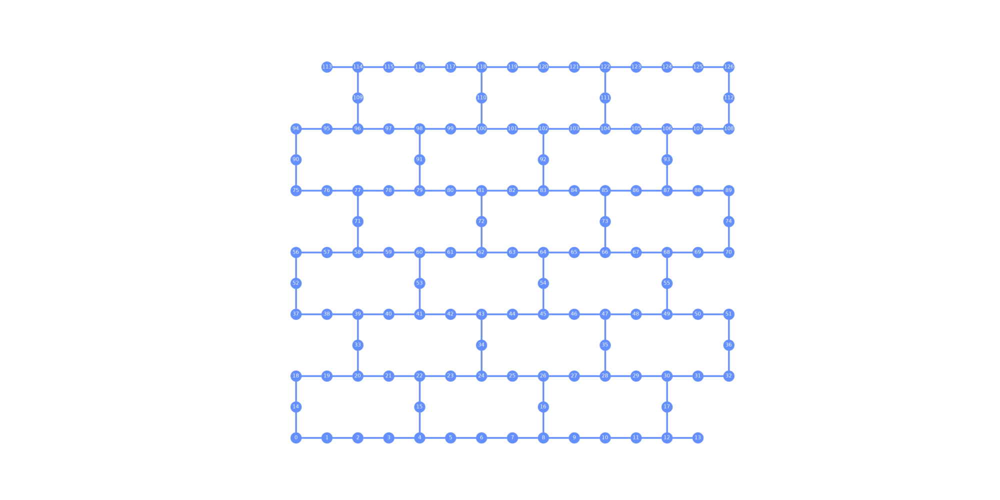
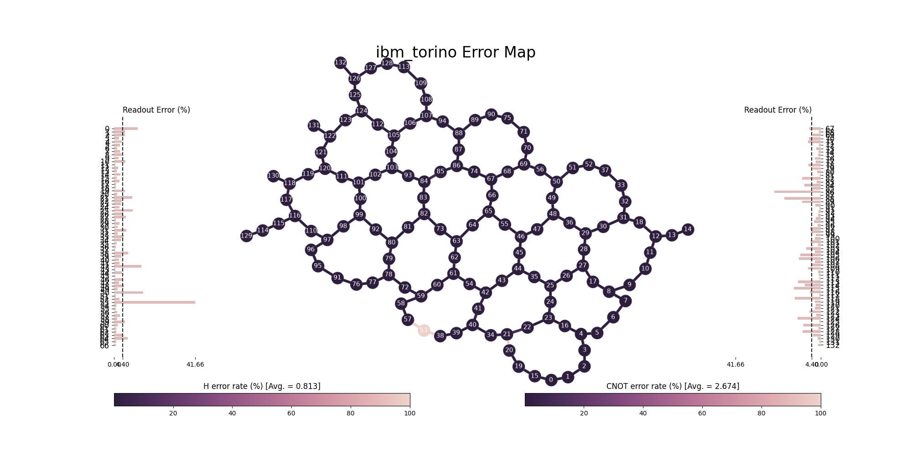
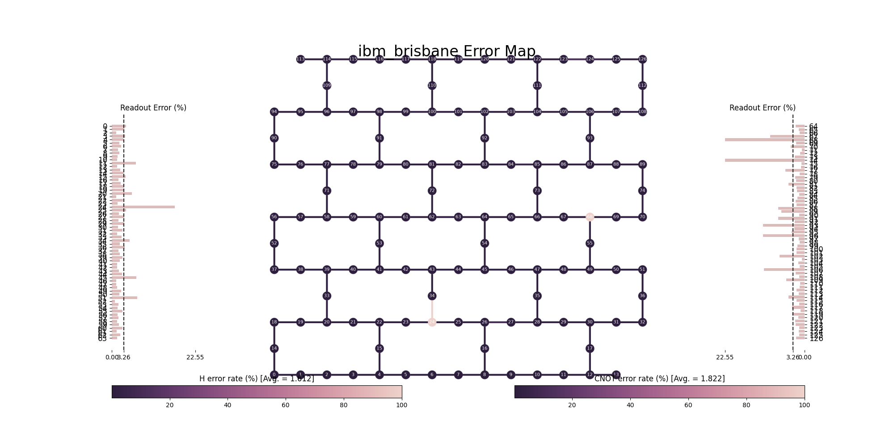

# Backend Information

## Qubit Map
This code displays the qubits in a Quantum computer including its couplings.
```python
from qiskit_ibm_runtime import QiskitRuntimeService
from qiskit.visualization import plot_gate_map

service = QiskitRuntimeService()

fig = plot_gate_map(service.backends()[0], figsize=(20,10))
fig.savefig(f'./circuits/{backend.name}_map.png')
```
Below you can see the qubit map for Torino and Brisbane IBM Quantum computers.





## Error Map
In order to display the error map, GraphViz (https://graphviz.org/download/) must be installed in the system where Jupyter Lab is running. 
```python
from qiskit_ibm_runtime import QiskitRuntimeService
from qiskit.visualization import plot_error_map

service = QiskitRuntimeService()

fig = plot_error_map(service.backends()[0], figsize=(20,10))
fig.savefig('./circuits/torino_error.png')
```  

The error map output for Torino IBM Quantum computer using the above code is:  



And the error map for Brisbane IBM Quantum computer is:



In each of these images, the geometric figure is the result of displaying the couplings between the different qubits but also the error leves for each qubit are displayed.
