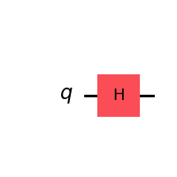

# Work in Progress

## Concepts

### States
$`\ket{+} = \frac{\ket{0}+\ket{1}}{\sqrt{2}}`$  
$`H\otimes\ket{0} = \ket{+}`$  
```python
qc = QuantumCircuit()
qc.h(0)
```
$`\ket{-} = \frac{\ket{0}-\ket{1}}{\sqrt{2}}`$  
$`H\otimes\ket{1} = \ket{-}`$
```python
qc = QuantumCircuit()
qc.x(0)
qc.h(0)
```
#### Bell States
There are four 'bell states'. 

$`\ket{\phi^+} = \frac{\ket{00}+\ket{11}}{\sqrt{2}}`$  
$`\ket{\phi^-} = \frac{\ket{00}-\ket{11}}{\sqrt{2}}`$  
$`\ket{\psi^+} = \frac{\ket{01}+\ket{10}}{\sqrt{2}}`$  
$`\ket{\psi^-} = \frac{\ket{01}-+\ket{10}}{\sqrt{2}}`$  

**Note**: Although in one test exam refers to the most 'perfect' Bell state there is no such 'perfect Bell state'. My assumption is that the most perfect is when both coeficients are closer to $`\frac{1}{\sqrt{2}}`$.

In order to generat these states with Qiskit you need a Hadamard (for superposition) and one CX (for entanglement). Then you need a combination of X and Z gates to obtain each of the four possible states.

$`\ket{\phi^+}`$  
```python
qc = QuantumCircuit()
qc.h(0)
qc.cx(0,1)
```
$`\ket{\phi^-} = \frac{\ket{00}-\ket{11}}{\sqrt{2}}`$  
```python
qc = QuantumCircuit()
qc.h(0)
qc.cx(0,1)
qc.z(1)
```
$`\ket{\psi^+} = \frac{\ket{01}+\ket{10}}{\sqrt{2}}`$  
```python
qc = QuantumCircuit()
qc.h(0)
qc.x(1)
qc.cx(0,1)
```
$`\ket{\psi^-} = \frac{\ket{01}-\ket{10}}{\sqrt{2}}`$  
```python
qc = QuantumCircuit()
qc.h(0)
qc.x(1)
qc.cx(0,1)
qc.z(1)
```
#### GHZ States
$`\ket{GHZ} = \frac{\ket{000}+\ket{111}}{\sqrt{2}}`$  
```python
qc = QuantumCircuit(3)
qc.h(0)
qc.cx([0,0],[1,2])
```

## Barriers
The valid ways to create barrier are (considering we have a three qubit circuit):  
-	qc.barrier(): barrier for all qubits  
-	qc.barrier(0,1) / qc.barrier([0,1]): barrier in q0 and q1  
-	qc.barrier(0,2) / qc.barrier([0,2]): barrier in q0 and q2  
-	qc.barrier(range(3)): barrier between q0 and q2  

These are not valid ways:
-	qc.barrier_all(): non existing method  

## Measures
The valid ways to create measures are (supposing we have a three qubit circuit):  
-	qc.measure_all(): meausres all qubits. Also adds a new set of classical bits (meas).  
-	qc.measure_all(add_bits=False): same as prevpious one but does not add the classical bits and uses the existing ones. If the circuit has no classical bits defined (or less than required) an exception is being raised.   
-	qc.measure([0,1,2],[0,1,2]) / qc.measure([0,2],[0,2]) / qc.measure(0,0): qubits and bits are mapped and they should be already defined in the circuit.  

These are not valid ways:  
-	qc.measure(): the mapping between qubits and classical bits is always required.

## Gates

Gates can be added in different ways to a QuantumCircuit. Using the 'classical' style based on QuantumCircuit's own methods.  
```python
qc = QuantumCircuit(2)
qc.cx(0,1)
```

Or defining a gate and appending it to the circuit. This is useful with custom gates or adding 'dynamic' circuits. Pay attention to the way the qubits are provided.
```python
# Create a CX gate
cx = CXGate()
# Add the gate
qc = QuantumCircuit(2)
qc.append(cx,[0,1])
```

#### ⚠️Important!
>  Keep in mind that it is also possible to use Python notation when indicating the qubits. So, for example, in a three  qubit circuit:<br>
qc.cx(0,-1) $\equiv$ qc.cx(0,2)  
qc.cx(-1,-2) $\equiv$ qc.cx(2,1)

Multiple gates of the same type can also be added using lists or ranges. 

```python
# These are all equivalent to:
# qc.x(0)
# qc.x(1)

qc.x([0,1]) 
qc.x(range(2))
qc.x([-1,-2])
```

### Controlled
In Qiskit any gate can be controlled by adding a couple of lines of code. For example, we may create a controlled RX:

```python
from qiskit.circuit.library import RXGate
import numpy as np

# Create the RX gate
rx = RXGate(np.pi/2)
# Add control 
crx = rx.control()

# Append to circuit using [control,target] qubits
qc = QuantumCircuit(2)
qc.append(crx,[0,1])
```
And the output circuit is:  


It is also possible to add more than one control qubit:

```python
from qiskit.circuit.library import RXGate
import numpy as np 

# Create the RX gate
rx = RXGate(np.pi/2)

# Add control 
crx = rx.control(num_ctrl_qubits=2)

# Append to circuit using [control,target] qubits
qc = QuantumCircuit(3)
qc.append(crx,[0,1,2])
#qc.append(rx,[1])
qc.draw('mpl')
```
And the output circuit in this case is:  


### 1 qubit

| Name | Qiskit | Picture | Unitary | Comments |
| :--: | ------ | ------- | :-----: | -------- |
| H/Hadamard | `qc.h(qubit0)` |  | $`\frac{1}{\sqrt{2}}\begin{bmatrix} 1 & 1  \\ 1 & -1  \end{bmatrix}`$  |  |
| X | `qc.x(qubit0)` |   | $`\begin{bmatrix} 0 & 1  \\ 1 & 0  \end{bmatrix}`$  | X-axis $`\pi `$ rotation |
| Y | `qc.y(qubit0)` |   | $`\begin{bmatrix} 0 & -i  \\ i & 0  \end{bmatrix}`$ | Y-axis $`\pi `$ rotation |
| Z | `qc.z(qubit0)` |   | $`\begin{bmatrix} 1 & 0  \\ 0 & -1  \end{bmatrix}`$ | Z-axis $`\pi `$ rotation |
| T | `qc.t(qubit0)` |   | $`\begin{bmatrix} 1 & 0  \\ 0 & e^{\frac{i\pi}{4}}  \end{bmatrix} `$ | $`S = T^2`$ <br> Z-axis $`\frac{\pi}{4}`$ rotation |
| T | `qc.t(qubit0)` |   | $`= \begin{bmatrix} 1 & 0  \\ 0 & \frac{\sqrt{2}}{2}+\frac{\sqrt{2}i}{2}  \end{bmatrix}`$ | $`S = T^2`$ |
| S | `qc.s(qubit0)` |   | $`\begin{bmatrix} 1 & 0  \\ 0 & i \end{bmatrix}`$ | $`Z = S^2`$ <br> Z-axis $`\frac{\pi}{2} `$ rotation |
| S† | `qc.sdg(qubit0)` |   | $`\begin{bmatrix}1 & 0\\0 & -i\end{bmatrix}`$ | $`S = T^2`$ <br> Z-axis $`\frac{-\pi}{2} `$ rotation |
| P | `qc.p(phi,qubit0)` |   | $`\begin{bmatrix} 1 & 0  \\ 0 & e^{i\phi}  \end{bmatrix} `$ | $`S = T^2`$ <br> Z-axis $`\frac{\pi}{4}`$ rotation |
#### Rotations
| Name | Qiskit | Picture | Unitary | Comments |
| :--: | ------ | ------- | :-----: | -------- |
| RX | `qc.rx(theta,qubit0)` |   | $`\begin{bmatrix} cos(\frac{\theta}{2}) & -i sin(\frac{\theta}{2})  \\ -i sin(\frac{\theta}{2}) & cos(\frac{\theta}{2})  \end{bmatrix}`$ |  |
| RY | `qc.ry(theta,qubit0)` |   | $`\begin{bmatrix} e^{\frac{-i\theta}{2}} & 0  \\ 0 & e^{\frac{i\theta}{2}}  \end{bmatrix}`$ |  |
| RZ | `qc.rz(theta,qubit0)` |   | $`\begin{bmatrix} e^{\frac{-i\theta}{2}} & 0  \\ 0 & e^{\frac{i\theta}{2}}  \end{bmatrix}`$ |  |
#### Deprecated in Qiskit 2.x (still present in some test exams)
| Name | Qiskit | Picture | Unitary | Comments |
| :--: | ------ | ------- | :-----: | -------- |
| U | `qc.rx(theta,phi,lambda,qubit0)` |   | $`\begin{bmatrix} cos(\frac{\theta}{2}) & -e^{i\lambda}sin(\frac{\theta}{2})  \\ e^{i\phi}sin(\frac{\theta}{2}) & e^{i(\phi+\lambda)}cos(\frac{\theta}{2})  \end{bmatrix}`$ |  |

Gates X,Y,Z,S,T and S† are just special cases of RX,RY,RZ (up to a global phase) 
| Name | Rotation |
| ---- | -------- | 
| X | RX({$`\pi`$}) |
| Y | RY({$`\pi`$}) |
| Z | RZ({$`\pi`$}) |
| S | RZ({$`2\pi`$}) |
| S | RZ({$`\pi`$}) |
| T | RZ({$`\frac{\pi}{2}`$}) |


### 2 qubit
| Name | Qiskit | Picture | Unitary | Comments |
| :--: | ------ | ------- | :-----: | -------- |
| SWAP | `qc.swap(qubit0,qubit1)` |  | $`\begin{bmatrix} 1 & 0 & 0 & 0 \\ 0 & 0 & 1 & 0 \\ 0 & 1 & 0 & 0 \\ 0 & 0 & 0 & 1 \end{bmatrix}`$  | |
#### Controlled
| Name | Qiskit | Picture | Unitary | Comments |
| :--: | ------ | ------- | :-----: | -------- |
| CX/CNOT | `qc.cx(qubit0,qubit1)` |  | $`\begin{bmatrix} 1 & 0 & 0 & 0 \\ 0 & 0 & 0 & 1 \\ 0 & 0 & 1 & 0 \\ 0 & 1 & 0 & 0 \end{bmatrix}`$  | |
| CX/CNOT | `qc.cx(qubit1,qubit0)` |  | $`\begin{bmatrix} 1 & 0 & 0 & 0 \\ 0 & 1 & 0 & 0 \\ 0 & 0 & 0 & 1 \\ 0 & 0 & 1 & 0 \end{bmatrix}`$ | |
| CY | `qc.cy(qubit0,qubit1)` |  | $`\begin{bmatrix} 1 & 0 & 0 & 0 \\ 0 & 0 & 0 & -i \\ 0 & 0 & 1 & 0 \\ 0 & i & 0 & 0 \end{bmatrix}`$  | |
| CY | `qc.cy(qubit1,qubit0)` |  | $`\begin{bmatrix} 1 & 0 & 0 & 0 \\ 0 & 1 & 0 & 0 \\ 0 & 0 & 0 & -i \\ 0 & 0 & i & 0 \end{bmatrix}`$ | |
| CZ | `qc.cz(qubit0,qubit1)` <br> `qc.cz(qubit0,qubit1)` |  | $`\begin{bmatrix} 1 & 0 & 0 & 0 \\ 0 & 1 & 0 & 0 \\ 0 & 0 & 1 & 0 \\ 0 & 0 & 0 & \text{-}1 \end{bmatrix} `$ | |
### 3 qubit
| Name | Qiskit | Picture | Unitary | Comments |
| :--: | ------ | ------- | :-----: | -------- |
| CCX / Toffoli |  |  | $`\begin{bmatrix} 1 & 0 & 0 & 0 & 0 & 0 & 0 & 0 \\ 0 & 1 & 0 & 0 & 0 & 0 & 0 & 0 \\ 0 & 0 & 1 & 0 & 0 & 0 & 0 & 0 \\ 0 & 0 & 0 & 0 & 0 & 0 & 0 & \textcolor{red}{1} \\ 0 & 0 & 0 & 0 & 1 & 0 & 0 & 0 \\ 0 & 0 & 0 & 0 & 0 & 1 & 0 & 0 \\ 0 & 0 & 0 & 0 & 0 & 0 & 1 & 0 \\ 0 & 0 & 0 & \textcolor{red}{1} & 0 & 0 & 0 & 0 \end{bmatrix}`$ | |
| CCZ |  |  | $`\begin{bmatrix} 1 & 0 & 0 & 0 & 0 & 0 & 0 & 0 \\ 0 & 1 & 0 & 0 & 0 & 0 & 0 & 0 \\ 0 & 0 & 1 & 0 & 0 & 0 & 0 & 0 \\ 0 & 0 & 0 & 1 & 0 & 0 & 0 & 0 \\ 0 & 0 & 0 & 0 & 1 & 0 & 0 & 0 \\ 0 & 0 & 0 & 0 & 0 & 1 & 0 & 0 \\ 0 & 0 & 0 & 0 & 0 & 0 & 1 & 0 \\ 0 & 0 & 0 & 0 & 0 & 0 & 0 & \textcolor{red}{\text{-}1} \end{bmatrix}`$ | |

