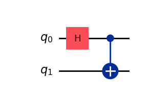
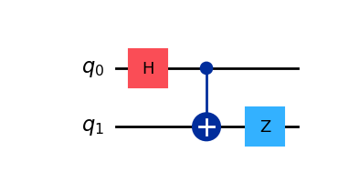
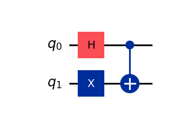
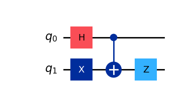
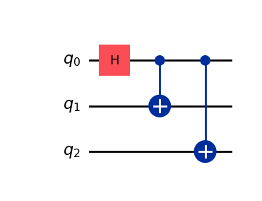
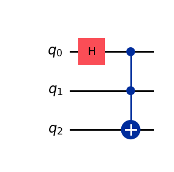

# ⚠️ Work in Progress!

# Concepts

## States
$`\ket{+} = \frac{\ket{0}+\ket{1}}{\sqrt{2}}`$  
$`H\otimes\ket{0} = \ket{+}`$  
```python
qc = QuantumCircuit()
qc.h(0)
```
$`\ket{-} = \frac{\ket{0}-\ket{1}}{\sqrt{2}}`$  
$`H\otimes\ket{1} = \ket{-}`$
```python
qc = QuantumCircuit()
qc.x(0)
qc.h(0)
```
### Bell States
There are four 'bell states'. Although in one test exams refers to the 'perfect' Bell state there is no such 'perfect Bell state'
$`\ket{\phi^+} = \frac{\ket{00}+\ket{11}}{\sqrt{2}}`$  
$`\ket{\phi^-} = \frac{\ket{00}-\ket{11}}{\sqrt{2}}`$  
$`\ket{\psi^+} = \frac{\ket{01}+\ket{10}}{\sqrt{2}}`$  
$`\ket{\psi^-} = \frac{\ket{01}-+\ket{10}}{\sqrt{2}}`$  

In order to generat these states with Qiskit you need a Hadamard (for superposition) and one CX (for entanglement). Then you need a combination of X and Z gates to obtain each of the four possible states.

#### $\ket{\phi^+}$  
$`\ket{\phi^+} = \frac{\ket{00}+\ket{11}}{\sqrt{2}}`$  
```python
qc = QuantumCircuit()
qc.h(0)
qc.cx(0,1)
```
  

#### $\ket{\phi^-}$  
$`\ket{\phi^-} = \frac{\ket{00}-\ket{11}}{\sqrt{2}}`$  
```python
qc = QuantumCircuit()
qc.h(0)
qc.cx(0,1)
qc.z(1)
```
  

#### $\ket{\psi^+}$  
$`\ket{\psi^+} = \frac{\ket{01}+\ket{10}}{\sqrt{2}}`$  
```python
qc = QuantumCircuit()
qc.h(0)
qc.x(1)
qc.cx(0,1)
```
  

#### $\ket{\psi^-}$  
$`\ket{\psi^-} = \frac{\ket{01}-+\ket{10}}{\sqrt{2}}`$  
```python
qc = QuantumCircuit()
qc.h(0)
qc.x(1)
qc.cx(0,1)
qc.z(1)
```
  
### GHZ States
$`\ket{GHZ} = \frac{\ket{000}+\ket{111}}{\sqrt{2}}`$  
```python
qc = QuantumCircuit(3)
qc.h(0)
qc.cx([0,0],[1,2]) 
```
  

**Do not be fooled ** with this one which is similar ... but not the same. This one uses a Toffoli gate and the output state is different:  

$`\psi = \frac{\ket{000}+\ket{001}}{\sqrt{2}}`$  
```python
qc = QuantumCircuit(3)
qc.h(0)
qc.ccx(0,1,2) 
```
  

