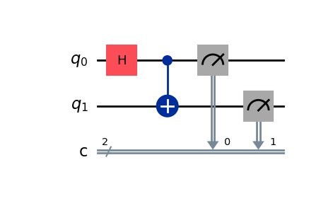
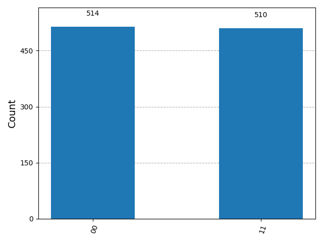
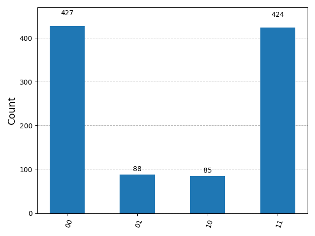

## Error Modelling
When using the Aer simulator, by default the output for an ideal case is displayed. We can also add an error model and see how the output changes when errors are considered.
We create a simple circuit:

```python  
from qiskit import QuantumCircuit
from qiskit_aer import AerSimulator

qc = QuantumCircuit(2, 2)
qc.h(0)
qc.cx(0, 1)
qc.measure([0, 1], [0, 1])
```


We simulate the circuit and plot the histogram of the output:

```python  
from qiskit_aer import AerSimulator
from qiskit.visualization import plot_histogram

simulator = AerSimulator()
result = simulator.run(qc, shots=1024).result()

counts = result.get_counts()
plot_histogram(counts)
```
And the output is:  

  

The statevector for this circuit is:  

$`\ket{\psi}=\frac{1}{\sqrt{2}}(\ket{00}+\ket{11})`$

So this is the expected result, a ~50% on each of the $`\ket{00}`$ and $`\ket{11}`$.

Then we create a noise model. This has been the most 'complex' part because there have been several changes from Qiskit 1.x and the examples did not work in Qiskit 2.x.

```python
from qiskit_aer.noise import NoiseModel, depolarizing_error, ReadoutError

# Create a depolarizing error for gates (still QuantumError)
cx_error = depolarizing_error(0.1, 2)

# Create a readout error using ReadoutError
meas_error = ReadoutError([[0.95, 0.05],  # P(0|0)=0.95, P(1|0)=0.05
                           [0.10, 0.90]]) # P(0|1)=0.10, P(1|1)=0.90

# Create noise model
noise_model = NoiseModel()
noise_model.add_all_qubit_quantum_error(cx_error, "cx")
noise_model.add_readout_error(meas_error, [0])
noise_model.add_readout_error(meas_error, [1])
```

And now we simulate again but using the noise model we have just created:

```python
from qiskit_aer import AerSimulator
simulator = AerSimulator(noise_model=noise_model)
result = simulator.run(qc, shots=1024).result()

counts = result.get_counts()
plot_histogram(counts)
```

The output now is:  

  

We can see that the error moves the results from the expected values.


