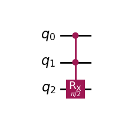
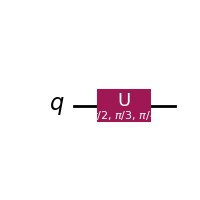

# ⚠️ Work in Progress!

# Gates

Gates can be added in different ways to a QuantumCircuit. Using the 'classical' style based on QuantumCircuit's own methods.  
```python
qc = QuantumCircuit(2)
qc.cx(0,1)
```

Or defining a gate and appending it to the circuit. This is useful with custom gates or adding 'dynamic' circuits. Pay attention to the way the qbits are provided.
```python
# Create a CX gate
cx = CXGate()
# Add the gate
qc = QuantumCircuit(2)
qc.append(cx,[0,1])
```

#### ⚠️Important!
>  Keep in mind that it is also possible to use Python notation when indicating the qbits. So, for example, in a three  qbit circuit:<br>
qc.cx(0,-1) $\equiv$ qc.cx(0,2)  
qc.cx(-1,-2) $\equiv$ qc.cx(2,1)

Multiple gates of the same type can also be added using lists or ranges. 

```python
# These are all equivalent to:
# qc.x(0)
# qc.x(1)

qc.x([0,1]) 
qc.x(range(2))
qc.x([-1,-2])
```

### Controlled
In Qiskit any gate can be controlled by adding a couple of lines of code. For example, we may create a controlled RX:

```python
from qiskit.circuit.library import RXGate
import numpy as np

# Create the RX gate
rx = RXGate(np.pi/2)
# Add control 
crx = rx.control()

# Append to circuit using [control,target] qbits
qc = QuantumCircuit(2)
qc.append(crx,[0,1])
```
And the output circuit is:  


It is also possible to add more than one control qbit:

```python
from qiskit.circuit.library import RXGate
import numpy as np 

# Create the RX gate
rx = RXGate(np.pi/2)
# Add control 
crx = rx.control(num_ctrl_qubits=2)
# Append to circuit using [control,target] qbits
qc = QuantumCircuit(3)
qc.append(crx,[0,1,2])
```
And the output circuit in this case is:  


### 1 QBit

| Name | Qiskit | Picture | Unitary | Comments |
| :--: | ------ | ------- | :-----: | -------- |
| H/Hadamard | `qc.h(qbit0)` |  | $`\frac{1}{\sqrt{2}}\begin{bmatrix} 1 & 1  \\ 1 & -1  \end{bmatrix}`$  |  |
| X | `qc.x(qbit0)` |   | $`\begin{bmatrix} 0 & 1  \\ 1 & 0  \end{bmatrix}`$  | X-axis $`\pi `$ rotation |
| Y | `qc.y(qbit0)` |   | $`\begin{bmatrix} 0 & -i  \\ i & 0  \end{bmatrix}`$ | Y-axis $`\pi `$ rotation |
| Z | `qc.z(qbit0)` |   | $`\begin{bmatrix} 1 & 0  \\ 0 & -1  \end{bmatrix}`$ | Z-axis $`\pi `$ rotation |
| T | `qc.t(qbit0)` |   | $`\begin{bmatrix} 1 & 0  \\ 0 & e^{\frac{i\pi}{4}}  \end{bmatrix} `$ | $`S = T^2`$ <br> Z-axis $`\frac{\pi}{4}`$ rotation |
| T | `qc.t(qbit0)` |   | $`= \begin{bmatrix} 1 & 0  \\ 0 & \frac{\sqrt{2}}{2}+\frac{\sqrt{2}i}{2}  \end{bmatrix}`$ | $`S = T^2`$ |
| S | `qc.s(qbit0)` |   | $`\begin{bmatrix} 1 & 0  \\ 0 & i \end{bmatrix}`$ | $`Z = S^2`$ <br> Z-axis $`\frac{\pi}{2} `$ rotation |
| S† | `qc.sdg(qbit0)` |   | $`\begin{bmatrix}1 & 0\\0 & -i\end{bmatrix}`$ | Z-axis $`\frac{-\pi}{2} `$ rotation |
| P | `qc.p(phi,qbit0)` |   | $`\begin{bmatrix} 1 & 0  \\ 0 & e^{i\phi}  \end{bmatrix} `$ | |
#### Rotations
| Name | Qiskit | Picture | Unitary | Comments |
| :--: | ------ | ------- | :-----: | -------- |
| RX | `qc.rx(theta,qbit0)` |   | $`\begin{bmatrix} cos(\frac{\theta}{2}) & -i sin(\frac{\theta}{2})  \\ -i sin(\frac{\theta}{2}) & cos(\frac{\theta}{2})  \end{bmatrix}`$ |  |
| RY | `qc.ry(theta,qbit0)` |   | $`\begin{bmatrix} e^{\frac{-i\theta}{2}} & 0  \\ 0 & e^{\frac{i\theta}{2}}  \end{bmatrix}`$ |  |
| RZ | `qc.rz(theta,qbit0)` |   | $`\begin{bmatrix} e^{\frac{-i\theta}{2}} & 0  \\ 0 & e^{\frac{i\theta}{2}}  \end{bmatrix}`$ |  |
#### Deprecated in Qiskit 2.x (still referenced in some test exams)
| Name | Qiskit | Picture | Unitary | Comments |
| :--: | ------ | ------- | :-----: | -------- |
| U | `qc.u(theta,phi,lambda,qbit0)` |   | $`\begin{bmatrix} cos(\frac{\theta}{2}) & -e^{i\lambda}sin(\frac{\theta}{2})  \\ e^{i\phi}sin(\frac{\theta}{2}) & e^{i(\phi+\lambda)}cos(\frac{\theta}{2})  \end{bmatrix}`$ |  |

Gates X,Y,Z,S,T and S† are just special cases of RX,RY,RZ (up to a global phase) 
| Name | Rotation |
| ---- | -------- | 
| X | RX({$`\pi`$}) |
| Y | RY({$`\pi`$}) |
| Z | RZ({$`\pi`$}) |
| S | RZ({$`2\pi`$}) |
| S | RZ({$`\pi`$}) |
| T | RZ({$`\frac{\pi}{2}`$}) |


### 2 QBit
| Name | Qiskit | Picture | Unitary | Comments |
| :--: | ------ | ------- | :-----: | -------- |
| SWAP | `qc.swap(qbit0,qbit1)` |  | $`\begin{bmatrix} 1 & 0 & 0 & 0 \\ 0 & 0 & 1 & 0 \\ 0 & 1 & 0 & 0 \\ 0 & 0 & 0 & 1 \end{bmatrix}`$  | |
#### Controlled
| Name | Qiskit | Picture | Unitary | Comments |
| :--: | ------ | ------- | :-----: | -------- |
| CX/CNOT | `qc.cx(qbit0,qbit1)` |  | $`\begin{bmatrix} 1 & 0 & 0 & 0 \\ 0 & 0 & 0 & 1 \\ 0 & 0 & 1 & 0 \\ 0 & 1 & 0 & 0 \end{bmatrix}`$  | |
| CX/CNOT | `qc.cx(qbit1,qbit0)` |  | $`\begin{bmatrix} 1 & 0 & 0 & 0 \\ 0 & 1 & 0 & 0 \\ 0 & 0 & 0 & 1 \\ 0 & 0 & 1 & 0 \end{bmatrix}`$ | |
| CY | `qc.cy(qbit0,qbit1)` |  | $`\begin{bmatrix} 1 & 0 & 0 & 0 \\ 0 & 0 & 0 & -i \\ 0 & 0 & 1 & 0 \\ 0 & i & 0 & 0 \end{bmatrix}`$  | |
| CY | `qc.cy(qbit1,qbit0)` |  | $`\begin{bmatrix} 1 & 0 & 0 & 0 \\ 0 & 1 & 0 & 0 \\ 0 & 0 & 0 & -i \\ 0 & 0 & i & 0 \end{bmatrix}`$ | |
| CZ | `qc.cz(qbit0,qbit1)` <br> `qc.cz(qbit0,qbit1)` |  | $`\begin{bmatrix} 1 & 0 & 0 & 0 \\ 0 & 1 & 0 & 0 \\ 0 & 0 & 1 & 0 \\ 0 & 0 & 0 & \text{-}1 \end{bmatrix} `$ | |
### 3 QBit
| Name | Qiskit | Picture | Unitary | Comments |
| :--: | ------ | ------- | :-----: | -------- |
| CCX / Toffoli |  |  | $`\begin{bmatrix} 1 & 0 & 0 & 0 & 0 & 0 & 0 & 0 \\ 0 & 1 & 0 & 0 & 0 & 0 & 0 & 0 \\ 0 & 0 & 1 & 0 & 0 & 0 & 0 & 0 \\ 0 & 0 & 0 & 0 & 0 & 0 & 0 & \textcolor{red}{1} \\ 0 & 0 & 0 & 0 & 1 & 0 & 0 & 0 \\ 0 & 0 & 0 & 0 & 0 & 1 & 0 & 0 \\ 0 & 0 & 0 & 0 & 0 & 0 & 1 & 0 \\ 0 & 0 & 0 & \textcolor{red}{1} & 0 & 0 & 0 & 0 \end{bmatrix}`$ | |
| CCZ |  |  | $`\begin{bmatrix} 1 & 0 & 0 & 0 & 0 & 0 & 0 & 0 \\ 0 & 1 & 0 & 0 & 0 & 0 & 0 & 0 \\ 0 & 0 & 1 & 0 & 0 & 0 & 0 & 0 \\ 0 & 0 & 0 & 1 & 0 & 0 & 0 & 0 \\ 0 & 0 & 0 & 0 & 1 & 0 & 0 & 0 \\ 0 & 0 & 0 & 0 & 0 & 1 & 0 & 0 \\ 0 & 0 & 0 & 0 & 0 & 0 & 1 & 0 \\ 0 & 0 & 0 & 0 & 0 & 0 & 0 & \textcolor{red}{\text{-}1} \end{bmatrix}`$ | |

