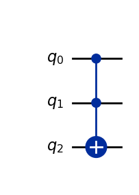
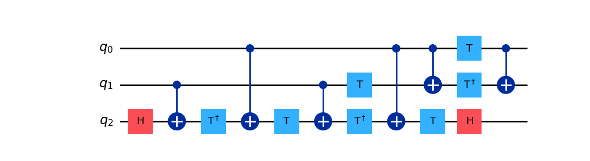

# ⚠️ Work in Progress!

# Basic

## Random information

### Versions
The Qiskit 2.x version can be found using the __version__ instance:
```python
from qiskit import __version__
__version__
```
Qiskit 1.x is no longer a monolithic SDK. So this is also valid for other modules such as qiskit_aer or qiskit_ibm_runtime.
In **Qiskit 1.x** the version coul be found by using:
```python
import qiskit
print(qiskit.__qiskit_version__)
```
And returned a JSON with the versions for each of the modules. But that is no longer the case. Any other exam answer is wrong.

## Circuits

### Composition
There are different ways to combine two different QuantumCircuits. If we have these circuits:  

```python
q1 = QuantumCircuit(1) 
q2a = QuantumCircuit(2) 
q2b = QuantumCircuit(2) 
```  
Then these are valid ways to combine those circuits 
- qc2.append(qc1.to_instruction(),[1])
- qc2.append(qc2b.to_instruction(),[0,1])
- qc2.compose(qc2b)

Additionally we have the option:
- qc2.tensor(qc2b)

While append/compose combine the circuits sequentially, tensor combines them in parallel.

The following options are not valid for combining circuits:
- pc2 + pc2b
- pc2.add(pc2b)

### Inverse
The only valid way to inverse a circuit is using:
- q.inverse()

These are not valid ways to get the inverse of a circuit:
- q.get_inverse()
- q.get_invert()

### Barriers
The valid ways to create barrier are (considering we have a three qbit circuit):  
-	qc.barrier(): barrier for all qbits  
-	qc.barrier(0,1) / qc.barrier([0,1]): barrier in q0 and q1  
-	qc.barrier(0,2) / qc.barrier([0,2]): barrier in q0 and q2  
-	qc.barrier(range(3)): barrier between q0 and q2  

These are not valid ways:
-	qc.barrier_all(): non existing method  

### Measures
The valid ways to create measures are (supposing we have a three qbit circuit):  
-	qc.measure_all(): measures all qbits. Also adds a new set of classical bits (meas).  
-	qc.measure_all(add_bits=False): same as previous one but does not add the classical bits and uses the existing ones. If the circuit has no classical bits defined (or less than required) an exception is being raised.   
-	qc.measure([0,1,2],[0,1,2]) / qc.measure([0,2],[0,2]) / qc.measure(0,0): qbits and bits are mapped and they should be already defined in the circuit.  
- qc.measure_active(): only the qbits being used are measured.
  
These are not valid ways:  
-	qc.measure(): the mapping between qbits and classical bits is always required.

### Drawing
The qc.draw() method accepts 'text', 'mpl' (which stands for Matplotlib library), 'latex' and 'latex_source'.

### Decompose
The method qc.decompose() transforms a circuit into basic one and tqo-qubit gates. For example for a 'simple' Toffoli gate (CCX):
```python
from qiskit import QuantumCircuit

qc = QuantumCircuit(3)
qc.ccx(0,1,2)
qc.draw('mpl')
```
  

After decomposition we get:
```python
qcd = qc.decompose()
qcd.draw('mpl')
```
  

A single Toffoli gate has been decomposed in a 9 one-qubit and 6 two-qubit gates in a circuit having now a depth of 11.

### Execution

#### Simulation
This is the big problem with Qiskit 1.x: most questions in exams and tutorials still refer to the old way of running the simulator. In Qiskit 2.x there is no longer the execute() method.  
There are two ways to access the simulator:  

1. Using the Aer class.  
```python
from qiskit_aer import Aer

sim = Aer.get_backend('unitary_simulator') # Or statevector_simulator, qasm_simulator, aer simulator...
job = sim.run(qc,shots = 1024)
result = job.result()
```
2. Using the AerSimulator class.  
```python
from qiskit_aer import AerSimulator

sim = AerSimulator()
job = sim.run(qc,shots = 1024)
result = job.result()
```
Depending on the simulator used, there will be different information provided in **result()**.

#### QPU
Execution in QPU in Qiskit 2.x has changed as the backend.run() method is no longer available. The use of Estimators and Samplers is the new way of accessing a QPU.  
**Note:** Using the real hardware requires having a token configured.  

##### Sampler
```python
from qiskit_ibm_runtime import QiskitRuntimeService
from qiskit_ibm_runtime import SamplerV2
from qiskit import transpile

service = QiskitRuntimeService()
backend = service.least_busy()

sampler = Sampler(mode=backend)

qct = transpile(qc,backend)
job = sampler.run([(qct,{})])
result = job.result()
```
