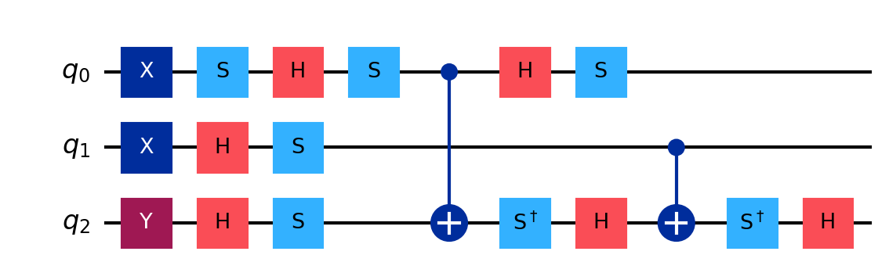

## Clifford combinations

The list of single qubit Cliffords the gates is small: $I, X, Y, Z, H, S$ and $S^\dagger$.
Each of these is its own inverse up to a global phase (they are Hermitian unitaries) except for S.

$X^2 = I; Y^2 = -I; Z^2 = I; H^2 = I$ but $S^2 = Z$ and $S \cdot S^\dagger = I$

The combination of Pauli gates is also a Pauli Gate. When combining X,Y,Z gates these rules of thumb are useful. 
If $`A,P \in \{ X,Y,Z \}`$ then:

1. Two Pauli gates:

$$
AB = -BA
$$

That means, for example, that $XZ = -ZX, XY=-YX$.

2. Three Pauli gates:  

$$
\begin{cases}
APA = A, & \text{if } A=P \\
APA = -A, & \text{if } A \neq P
\end{cases}
$$
    
This works because:

$APA = A(PA) = A(-AP) = -A^2P = -P$

That means, for example, that $XXX = X, XYX=-Y, XZX = -Z$.

# Clifford 

Clifford circuits are a special class of quantum circuits built entirely from Clifford gates, which are gates that map Pauli operators to other Pauli operators under conjugation: H, S, X, Y, Z, CNOT.

An N-qubit unitary operator from the Clifford group is stored as a length 2N × (2N+1) boolean tableau using the convention:
    - Rows 0 to N-1 are the destabilizer group generators
    - Rows N to 2N-1 are the stabilizer group generators.

An example of a Clifford random circuit generated with the random_clifford statement:

```python
from qiskit.quantum_info import random_clifford

clifford = random_clifford(3)
qc = clifford.to_circuit()
qc.draw('mpl')
```


A *print* of this variable displays the stabilizer and destabilizer. They can also be retrieved using the **to_labels(mode='S')** and **to_labels(mode='D')** methods.

```python
print(clifford)
```

```
Clifford: Stabilizer = ['-ZZX', '-YYI', '-XZY'], Destabilizer = ['+ZZZ', '+IZI', '-YIY']
```

Whereas a display shows the tableau:
```python
display(clifford)
```

```
Clifford(array([[False, False, False,  True,  True,  True, False],
       [False, False, False, False,  True, False, False],
       [ True, False,  True,  True, False,  True,  True],
       [ True, False, False, False,  True,  True,  True],
       [False,  True,  True, False,  True,  True,  True],
       [ True, False,  True,  True,  True, False,  True]]))
```


