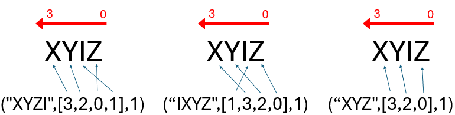

# Pauli
Pauli gates are $I, X, Y, Z$. Clifford = Pauli + $S,H$.

The combination of Pauli gates returns another Pauli gate (up to a global phase)

$P = (-i)^q P_{n-1}\otimes...\otimes P_0$

Where $q \in \mathbb{Z^4}$ and $P \in {I, X, Y, Z}$ are the single qubit Pauli matrices:  

$$
I = 
\left[\begin{array}{cc}1 & 0 \\ 
0 & 1\end{array}\right]
\quad
X = 
\left[\begin{array}{cc}0 & 1 \\ 
1 & 0\end{array}\right]
\quad
Y = 
\left[\begin{array}{cc}0 & -i \\ 
i & 0\end{array}\right]
\quad
Z = 
\left[\begin{array}{cc}1 & 0 \\ 
0 & -1\end{array}\right]
$$

Keeping $q \in \mathbb{Z^4}$ means that the phase term will only have four possible values: 1, -i, -1, i.

## Qiskit

In Qiskit a Pauli gate can be declared in two ways.

1. Pauli(x,z[,phase])  
   Here we are expressing the sequence of Pauli gates by combining sequences of bits.
   | x | z | Pauli |
   |:-:|:-:|:-----:|
   | 0 | 0 | I |
   | 0 | 1 | Z |
   | 1 | 0 | X |
   | 1 | 1 | Y |
   
   The phase is optional. If not indicated, the phase is zero. Accepted values are 0,1,2,3.

   **Note:** While this might seem a convention, it is true that XZ = Y (up to a global phase)

   For example, Pauli(np.array([0,1]),np.array([0,0]),1) returns the two gate Pauli '-iIX'. 
   
3. Pauli(obj)  
   In this case obj is a Pauli string, i.e. Pauli('XYZ') or Pauli('-iYZI'). 

## Evaluation  
If provided with a Pauli string, the resulting matrix has to be calculated using tensor products. That means that the dimension of the array is $2^n$ the size of the string.  

$$
IX = \left[\begin{array}{cc}1 & 0 \\ 
0 & 1\end{array}\right] 
\otimes 
\left[\begin{array}{cc}0 & 1 \\ 
1 & 0\end{array}\right] 
= \left[\begin{array}{cc}1 \dot {\left[\begin{array}{cc}0 & 1 \\ 
1 & 0 \end{array}\right]} & 0 \\ 
0 & 1 \dot {\left[\begin{array}{cc}0 & 1 \\ 
1 & 0\end{array}\right]} \end{array}\right]
= \left[\begin{array}{cc}0 & 1 & 0 & 0\\ 
1 & 0 & 0 & 0\\
0 & 0 & 0 & 1\\
0 & 0 & 1 & 0\end{array}\right] 
$$

# SparsePauliOp
While the Pauli class represents a single Pauli string, the SparsePauliOp represents a linear combination of Pauli strings. There are different ways to initialize a SparsePauliOp but the most flexible one is using the method **from_sparse_list**.

SparsePauliOp are used to model Hamiltonians. The **from_sparse_list** method is a bit ... criptic until you get the key. Let's say we have this Hamiltonian:

$$ H = Z_1 X_3 + Y_2 Z_1 + Z_3 Y_1 $$ 

Then we can define that Hamiltonian in Qiskit:

```python
op = SparsePauliOp.from_sparse_list([("ZX", [1, 3], 1), ("YZ", [2, 1], 1), ("ZY", [3, 1], 1)], num_qubits=4)
```
Which then is shown in list form using the to_list() method as:  
```
[('XIZI', (1+0j)), ('IYZI', (1+0j)), ('ZIYI', (1+0j))]
```
So, each element in a Pauli list has a string of gates, the array of positions and the coefficient. Let's leave the coeficient as 1 for now. We may use different strings and adjusting the list of positions, the resulting operator will be the same.
For example:  



- The gates in the list can be in any order as long as we adjust the positions accordingly.
- If one gate is not needed we can skip it. 
- If it is required more than once, then we need to include it in the list multiple times.
- The positions should be all different as repeating a number means we try to place multiple gates in the string in the same position.
- The I gate can be ignored. Any position which is not included will be replaced with an I gate.

**Note:** Keep in mind that the numbering is from right left to left.

The coeficient is just a **global** multiplier for the whole list of gates. 

Finally the number of qubits indicates how many qubits in size should be the resulting SparsePauliOp. If we just define 3 qubits but the number of qubits is six, then three I gates will be added for padding. 
This is important because, when running on real hardware, the size of the string must match the number of qubits in the backend.

These two strings just differ in the number of qubits:
```python
op = SparsePauliOp.from_sparse_list([("XY",[1,0],2)],num_qubits=2)
op.to_sparse_list()
```
```
[('XY', (2+0j))]
```
```python
op = SparsePauliOp.from_sparse_list([("XY",[1,0],2)],num_qubits=6)
op.to_sparse_list()
```
```
[('IIIIXY', (2+0j))]
```


