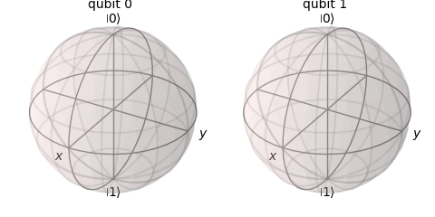

# Tricky
A compilation of questions which I have found to be tricky.

# Gates

## Rx / Ry / Rz rotations

When finding the probabilities to find $\ket{0}$ or $\ket{1}$ after applying one of those gates:  
1. Check if the rotation is being applied to $\ket{0}$ or $\ket{1}$  
1. Then check which operation is being applied!
   
Keep in mind that ...
- **Rz** *does not* change the probabilities of finding any of those when applied to $\ket{0}$ or $\ket{1}$.
  
So, when applied to $\ket{0}$:

$$P(0)=1$$
$$P(1)=0$$    

And, when applied to $\ket{1}$  

$$P(1)=1$$  
$$P(0)=0$$    

- **Ry** changes the value of $\theta$. The unitary matrix is:
  
$$\left[\begin{array}{cc}\cos\left(\frac{\theta}{2}\right) & -\sin\left(\frac{\theta}{2}\right) \\
\sin\left(\frac{\theta}{2}\right) & \cos\left(\frac{\theta}{2}\right)\end{array}\right]$$


So, when applied to $\ket{0}$:

$$R_y(\theta)\ket{0} = \cos\left( \frac{\theta}{2} \right)\ket{0}+\sin\left( \frac{\theta}{2} \right)\ket{1}$$  
$$P(0)=\cos^2\left( \frac{\theta}{2} \right)$$  
$$P(1)=\sin^2\left( \frac{\theta}{2} \right)$$    

And, when applied to $\ket{1}$  

$$R_y(\theta)\ket{1} = -\sin\left( \frac{\theta}{2} \right)\ket{0}+\cos\left( \frac{\theta}{2} \right)\ket{1}$$  
$$P(0)=\sin^2\left( \frac{\theta}{2} \right)$$   
$$P(1)=\cos^2\left( \frac{\theta}{2} \right)$$  

For example, if the gate is $R_{y}(\frac{3*\pi}{4})$ the probabilities are:

$$\theta=\frac{3*\pi}{4} \rightarrow \cos\left( \frac{\theta}{2} \right) = \cos(\frac{3*\pi}{8}) \approx 0.382; \sin\left( \frac{\theta}{2} \right) = \sin(\frac{3*\pi}{8}) \approx 0.923; $$

$$\ket{0} \Rightarrow P(0)=\cos^2\left( \frac{\theta}{2} \right) \approx 0.146; P(1)=\sin^2\left( \frac{\theta}{2} \right) \approx 0.854$$  
$$\ket{1} \Rightarrow P(0)=\sin^2\left( \frac{\theta}{2} \right) \approx 0.854; P(1)=\cos^2\left( \frac{\theta}{2} \right) \approx 0.146$$  

- **Rx** changes the value of $\theta$. The unitary matrix is:
  
$$\left[\begin{array}{cc}\cos\left(\frac{\theta}{2}\right) & -i\sin\left(\frac{\theta}{2}\right) \\
-i\sin\left(\frac{\theta}{2}\right) & \cos\left(\frac{\theta}{2}\right)\end{array}\right]$$

So, when applied to $\ket{0}$:

$$R_y(\theta)\ket{0} = \cos\left( \frac{\theta}{2} \right)\ket{0}-i\sin\left( \frac{\theta}{2} \right)\ket{1}$$  
$$P(0)=\cos^2\left( \frac{\theta}{2} \right)$$  
$$P(1)=\sin^2\left( \frac{\theta}{2} \right)$$    

And, when applied to $\ket{1}$  

$$R_y(\theta)\ket{1} = -i\sin\left( \frac{\theta}{2} \right)\ket{0}+\cos\left( \frac{\theta}{2} \right)\ket{1}$$  
$$P(0)=\sin^2\left( \frac{\theta}{2} \right)$$   
$$P(1)=\cos^2\left( \frac{\theta}{2} \right)$$  

For example, if the gate is $R_{x}(\frac{3*\pi}{4})$ then the probabilities are:

$$\theta=\frac{3*\pi}{4} \rightarrow \cos\left( \frac{\theta}{2} \right) = \cos(\frac{3*\pi}{8}) \approx 0.382; \sin\left( \frac{\theta}{2} \right) = \sin(\frac{3*\pi}{8}) \approx 0.923; $$

$$\ket{0} \Rightarrow P(0)=\cos^2\left( \frac{\theta}{2} \right) \approx 0.146; P(1)=\sin^2\left( \frac{\theta}{2} \right) \approx 0.854$$  
$$\ket{1} \Rightarrow P(0)=\sin^2\left( \frac{\theta}{2} \right) \approx 0.854; P(1)=\cos^2\left( \frac{\theta}{2} \right) \approx 0.146$$  

**Note1**: When applying the gates $R_x$ and $R_y$ to $\ket{0}$ and $\ket{1}$, the probabilities P(0) and P(1) are the same.  
**Note2**: $\frac{3*\pi}{8} = 66.7º$ so, if $60º<\frac{3*\pi}{8}<90º$, then $\frac{1}{2}>\cos(\frac{3*\pi}{8})>0$ and $\frac{\sqrt{3}}{2}<\sin(\frac{3*\pi}{8})<1$.  

## Methods
Questions related with unexisting methods.  
This is specially tricky when dealing with questions which were having Qiskit 1.x (or Qiskit 0.x) in mind.

- What will occur when the following code is executed?
```python
c = ClassicalRegister(2)
c.draw()
```
Neither ClassicalRegister nor QuantumRegister have a draw method. So, an error is returned.

## Visualizations

### Statevector
When selecting the bloch sphere for the **statevector** of a **single** qubit, keep in mind that a **global phase** does not affect the display and only two coordinates are required. 

| Statevectors | Bloch |
|:------------:|:-----:|
| $\left[\frac{\sqrt\{2}}{2},\frac{\sqrt\{2}}{2}\right] \left[-\frac{\sqrt\{2}}{2},-\frac{\sqrt\{2}}{2}\right]$<br>$\frac{\sqrt\{2}}{2}\ket{0}+\frac{\sqrt\{2}}{2}\ket{1}$<br>$-\frac{\sqrt\{2}}{2}\ket{0}-\frac{\sqrt\{2}}{2}\ket{1}$| |
| $\left[\frac{\sqrt\{2}}{2},-\frac{\sqrt\{2}}{2}\right] \left[-\frac{\sqrt\{2}}{2},\frac{\sqrt\{2}}{2}\right]$<br>$\frac{\sqrt\{2}}{2}\ket{0}-\frac{\sqrt\{2}}{2}\ket{1}$<br>$-\frac{\sqrt\{2}}{2}\ket{0}+\frac{\sqrt\{2}}{2}\ket{1}$| |
| $\left[\frac{\sqrt\{2}}{2},\frac{\sqrt\{2}i}{2}\right] \left[-\frac{\sqrt\{2}}{2},-\frac{\sqrt\{2}i}{2}\right]$<br>$\frac{\sqrt\{2}}{2}\ket{0}+\frac{\sqrt\{2}i}{2}\ket{1}$<br>$-\frac{\sqrt\{2}}{2}\ket{0}-\frac{\sqrt\{2}i}{2}\ket{1}$| |
| $\left[\frac{\sqrt\{2}}{2},-\frac{\sqrt\{2}i}{2}\right] \left[-\frac{\sqrt\{2}}{2},\frac{\sqrt\{2}i}{2}\right]$<br>$\frac{\sqrt\{2}}{2}\ket{0}-\frac{\sqrt\{2}i}{2}\ket{1}$<br>$-\frac{\sqrt\{2}}{2}\ket{0}+\frac{\sqrt\{2}i}{2}\ket{1}$| |

### Bloc Sphere

When answering a question, keep in mind that spheres in the bloch_multivector show the qubits in reverse order compared to qubit notation. So, the following diagram shows state $\ket{10}$ and therefore the correct state vector would be **[0,0,1,0]** (and not [0,1,0,0] or any other).

  

#### Entanglement 

When two (or more) qubits are entangled, it is not possible to display their status in a bloch sphere and so the sphheres are displayed with no vector.

  


