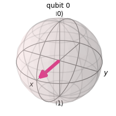
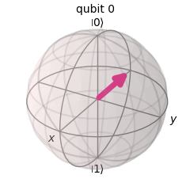
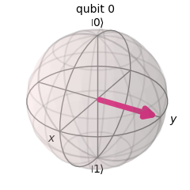
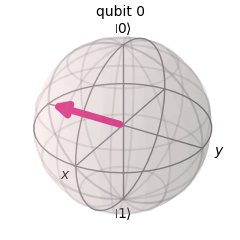
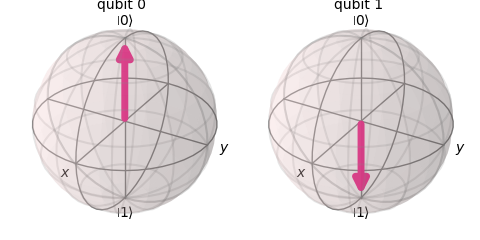
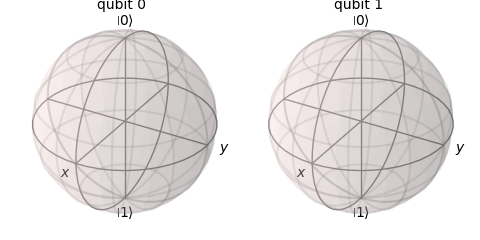
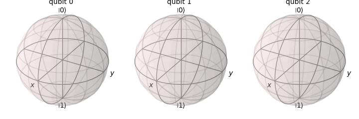

# Tricky
A compilation of questions which I have found to be tricky.

# Random
- What does QASM stand for?
Quantum Assembly Language

- Which are the eigenstates of the X axis?  
The eigenstates of the different axis are:
    - Z axis: $\ket{0}$ and $\ket{1}$
    - X axis: $\ket{+}$ and $\ket{-}$
    - Y axis: $\ket{+i}$ and $\ket{-i}$
 
- Which is the default (or computational) basis for Quantum operations?  
The Z axis.

- What does "quantum volume" measure?

The overall performance and error rates of quantum hardware. Not only the number of qubits but also:  
    - Number of qubits: usable qubits, not just the total.  
    - Gate fidelity: how accurate the operations are.  
    - Connectivity: how easily qubits can interact.  
    - Circuit depth: how many sequential operations can be done before noise overwhelms the result.  
    - Compilation efficiency: how well the hardware executes random circuits.  

- Which statement generates a random state vector?
The statement which generates a random state vector is qiskit.quantum_info.random_statevector.
There are also several statements for declaring other objects:

| Statement | Description | Returns |
|-----------|-------------|---------|
| random_statevector | A state vector | Statevector | 
| random_unitary | A unitary operator | Operator | 
| random_density_matrix | A density matrix | DensityMatrix | 
| random_pauli | A pauli string | Pauli | 
| random_clifford | A N-qubit unitary operator from the Clifford group | Clifford | 

# Gates

## Clifford

- Which one of the provided identities are correct?

The combination of Clifford gates is better described in . Just for answering those questions related with Clifford gates identities:

| X Gate | Y Gate | Z Gate | H Gate | S Gate |
|--------|--------|--------|--------|--------|
| XXX = X | YXY = -X | ZXZ = -X | HXH = Z |  SXS† = Y /  S†XS = -Y |
| XYX = -Y | YYY = Y | ZYZ = -Y | HYH = -Y | SYS† = −X / S†YS = X |
| XZX = -Z | YZY = -Z | ZZZ = Z | HZH = X | SZS† = Z / S†ZS = Z |  

## Rx / Ry / Rz rotations

When finding the probabilities to find $\ket{0}$ or $\ket{1}$ after applying one of those gates:  
1. Check if the rotation is being applied to $\ket{0}$ or $\ket{1}$  
1. Then check which operation is being applied!
   
Keep in mind that ...
- **Rz** *does not* change the probabilities of finding any of those when applied to $\ket{0}$ or $\ket{1}$.
  
So, when applied to $\ket{0}$:

$$P(0)=1$$
$$P(1)=0$$    

And, when applied to $\ket{1}$  

$$P(1)=1$$  
$$P(0)=0$$    

- **Ry** changes the value of $\theta$. The unitary matrix is:
  
$$\left[\begin{array}{cc}\cos\left(\frac{\theta}{2}\right) & -\sin\left(\frac{\theta}{2}\right) \\
\sin\left(\frac{\theta}{2}\right) & \cos\left(\frac{\theta}{2}\right)\end{array}\right]$$


So, when applied to $\ket{0}$:

$$R_y(\theta)\ket{0} = \cos\left( \frac{\theta}{2} \right)\ket{0}+\sin\left( \frac{\theta}{2} \right)\ket{1}$$  
$$P(0)=\cos^2\left( \frac{\theta}{2} \right)$$  
$$P(1)=\sin^2\left( \frac{\theta}{2} \right)$$    

And, when applied to $\ket{1}$  

$$R_y(\theta)\ket{1} = -\sin\left( \frac{\theta}{2} \right)\ket{0}+\cos\left( \frac{\theta}{2} \right)\ket{1}$$  
$$P(0)=\sin^2\left( \frac{\theta}{2} \right)$$   
$$P(1)=\cos^2\left( \frac{\theta}{2} \right)$$  

For example, if the gate is $R_{y}(\frac{3*\pi}{4})$ the probabilities are:

$$\theta=\frac{3*\pi}{4} \rightarrow \cos\left( \frac{\theta}{2} \right) = \cos(\frac{3*\pi}{8}) \approx 0.382; \sin\left( \frac{\theta}{2} \right) = \sin(\frac{3*\pi}{8}) \approx 0.923; $$

$$\ket{0} \Rightarrow P(0)=\cos^2\left( \frac{\theta}{2} \right) \approx 0.146; P(1)=\sin^2\left( \frac{\theta}{2} \right) \approx 0.854$$  
$$\ket{1} \Rightarrow P(0)=\sin^2\left( \frac{\theta}{2} \right) \approx 0.854; P(1)=\cos^2\left( \frac{\theta}{2} \right) \approx 0.146$$  

- **Rx** changes the value of $\theta$. The unitary matrix is:
  
$$\left[\begin{array}{cc}\cos\left(\frac{\theta}{2}\right) & -i\sin\left(\frac{\theta}{2}\right) \\
-i\sin\left(\frac{\theta}{2}\right) & \cos\left(\frac{\theta}{2}\right)\end{array}\right]$$

So, when applied to $\ket{0}$:

$$R_y(\theta)\ket{0} = \cos\left( \frac{\theta}{2} \right)\ket{0}-i\sin\left( \frac{\theta}{2} \right)\ket{1}$$  
$$P(0)=\cos^2\left( \frac{\theta}{2} \right)$$  
$$P(1)=\sin^2\left( \frac{\theta}{2} \right)$$    

And, when applied to $\ket{1}$  

$$R_y(\theta)\ket{1} = -i\sin\left( \frac{\theta}{2} \right)\ket{0}+\cos\left( \frac{\theta}{2} \right)\ket{1}$$  
$$P(0)=\sin^2\left( \frac{\theta}{2} \right)$$   
$$P(1)=\cos^2\left( \frac{\theta}{2} \right)$$  

For example, if the gate is $R_{x}(\frac{3*\pi}{4})$ then the probabilities are:

$$\theta=\frac{3*\pi}{4} \rightarrow \cos\left( \frac{\theta}{2} \right) = \cos(\frac{3*\pi}{8}) \approx 0.382; \sin\left( \frac{\theta}{2} \right) = \sin(\frac{3*\pi}{8}) \approx 0.923; $$

$$\ket{0} \Rightarrow P(0)=\cos^2\left( \frac{\theta}{2} \right) \approx 0.146; P(1)=\sin^2\left( \frac{\theta}{2} \right) \approx 0.854$$  
$$\ket{1} \Rightarrow P(0)=\sin^2\left( \frac{\theta}{2} \right) \approx 0.854; P(1)=\cos^2\left( \frac{\theta}{2} \right) \approx 0.146$$  

**Note1**: When applying the gates $R_x$ and $R_y$ to $\ket{0}$ and $\ket{1}$, the probabilities P(0) and P(1) are the same.  
**Note2**: $\frac{3*\pi}{8} = 66.7º$ so, if $60º<\frac{3*\pi}{8}<90º$, then $\frac{1}{2}>\cos(\frac{3*\pi}{8})>0$ and $\frac{\sqrt{3}}{2}<\sin(\frac{3*\pi}{8})<1$.  

## Methods / Properties
Questions related with unexisting or rarely used methods/properties.  
This is specially tricky when dealing with questions which were having Qiskit 1.x (or Qiskit 0.x) in mind.

### Circuits

#### QuantumCircuit
The QuantumCirtcuit constructor accepts multiple parameters:

- **filename**: Sends the image directly to a file without having to use savefig.
- **scale**: Scale of image to draw.
- **style**: There are different options:
    - The name of one of the accepted formats: "iqp" (default), "iqp-dark", "clifford", "textbook" or "bw".
    - A JSON value with a list of key:value properties which allow to change the looks:
      | Property | Description |
      |----------|-------------|
      | backgroundcolor | Background color of the circuit |
      | linecolor | Color of the qubit lines |
      | creglinecolor | Color of the classical bit lines |
      | creglinestyle | Style for the classical bit lines ('-', '--', '-.', ':', 'None', ' ', '', 'solid', 'dashed', 'dashdot', 'dotted') |
      | barrierfacecolor | Color of the barrier |
      | textcolor | Color of the text (except for the gates) |
      | gatetextcolor | Color for the text in the gates |
      | fontsize | Text size for qubits and gates |
      | subfontsize | Text size for details (phases in gates) |
      | displaytext | Another JSON which allows providing an alternate text for each of the gates ('h','x',...) |
    - ~A file which includes a definition of all the styles.~
- **initial_state**: Wether the $\ket{0}$ at the start of a circuit should be included or not (default).
- **reverse_bits**: Reverses the order of the qubits in the circuit displayed.
- **plot_barriers**: Wether the barriers in the circuit have to be displayed (default) or not.
- **measure_arrows** (2.2+): Wether the arrows between qubits and classical bits will be drawn (default) or the name of the bit will be placed close to the qubit.
- **fold**: The number of gates to be displayed before breaking the circuit into a new line. The default is 25. If zero is provided the circuit is not broken.
- **wire_order**: Allows selecting the order of the wires in the circuit.
- **cregbundle**: Wether we want all the classical bits in one line (default) or not.
- **idle_wires**: Display idle wires (default) or not.

### Registers
- What will occur when the following code is executed?
```python
c = ClassicalRegister(2)
c.draw()
```
Neither ClassicalRegister nor QuantumRegister have a draw method. So, an error is returned.

## Statevectors

- Which of the following statevectors represent sv in the given below code
fragment?
```python
sv = Statevector.from_int(3,2**3)
```
That notation was a bit tricky for me until I found the logic. The second parameter provides the dimensions. In this case 2**3 = 8 means we have 3 qubits. The first one is the state. In this case 3 = $\ket{011}$ so just the fourth element (0 based) is a one.
And the answer is [0,0,0,1,0,0,0,0].

## Visualizations

### Statevector
When selecting the bloch sphere for the **statevector** of a **single** qubit, keep in mind that a **global phase** does not affect the display and only two coordinates are required. 

| Statevectors | Bloch |
|:------------:|:-----:|
| $\left[\frac{\sqrt\{2}}{2},\frac{\sqrt\{2}}{2}\right] \left[-\frac{\sqrt\{2}}{2},-\frac{\sqrt\{2}}{2}\right]$<br>$\frac{\sqrt\{2}}{2}\ket{0}+\frac{\sqrt\{2}}{2}\ket{1}$<br>$-\frac{\sqrt\{2}}{2}\ket{0}-\frac{\sqrt\{2}}{2}\ket{1}$| |
| $\left[\frac{\sqrt\{2}}{2},-\frac{\sqrt\{2}}{2}\right] \left[-\frac{\sqrt\{2}}{2},\frac{\sqrt\{2}}{2}\right]$<br>$\frac{\sqrt\{2}}{2}\ket{0}-\frac{\sqrt\{2}}{2}\ket{1}$<br>$-\frac{\sqrt\{2}}{2}\ket{0}+\frac{\sqrt\{2}}{2}\ket{1}$| |
| $\left[\frac{\sqrt\{2}}{2},\frac{\sqrt\{2}i}{2}\right] \left[-\frac{\sqrt\{2}}{2},-\frac{\sqrt\{2}i}{2}\right]$<br>$\frac{\sqrt\{2}}{2}\ket{0}+\frac{\sqrt\{2}i}{2}\ket{1}$<br>$-\frac{\sqrt\{2}}{2}\ket{0}-\frac{\sqrt\{2}i}{2}\ket{1}$| |
| $\left[\frac{\sqrt\{2}}{2},-\frac{\sqrt\{2}i}{2}\right] \left[-\frac{\sqrt\{2}}{2},\frac{\sqrt\{2}i}{2}\right]$<br>$\frac{\sqrt\{2}}{2}\ket{0}-\frac{\sqrt\{2}i}{2}\ket{1}$<br>$-\frac{\sqrt\{2}}{2}\ket{0}+\frac{\sqrt\{2}i}{2}\ket{1}$| |

### Bloc Sphere

**Note:** Bloch spheres for statevectors can be displayed using either plot_bloch_multivector or the method draw('bloch') in the class Statevector.

When answering a question, keep in mind that spheres in the bloch_multivector show the qubits in reverse order compared to qubit notation. So, the following diagram shows state $\ket{10}$ and therefore the correct state vector would be **$\ket{10}$** or **[0,0,1,0]** (and not [0,1,0,0] or any other).

  

#### Entanglement 

When two (or more) qubits are entangled, it is not possible to display their status in a bloch sphere and so the spheres are displayed with no vector.

| Statevectors | Bloch |
|:------------:|:-----:|
| $\frac{\sqrt\{2}}{2}\ket{00}+\frac{\sqrt\{2}}{2}\ket{11}$ |  |
| $\frac{\sqrt\{2}}{2}\ket{000}+\frac{\sqrt\{2}}{2}\ket{111}$ | |


