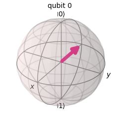

# Tricky
A compilation of questions which I have found to be tricky.

## Methods
Questions related with unexisting methods.  
This is specially tricky when dealing with questions which were having Qiskit 1.x (or Qiskit 0.x) in mind.

- What will occur when the following code is executed?
```python
c = ClassicalRegister(2)
c.draw()
```
Neither ClassicalRegister nor QuantumRegister have a draw method. So, an error is returned.

## Visualizations

### Bloc Sphere

When answering a question, keep in mind that spheres in the bloch_multivector show the qubits in reverse order compared to qubit notation. So, the following diagram shows state $\ket{10}$ and therefore the correct state vector would be **[0,0,1,0]** (and not [0,1,0,0] or any other).

  

### Entanglement 

When two (or more) qubits are entangled, it is not possible to display their status in a bloch sphere and so the sphheres are displayed with no vector.

  


