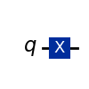

<h1>Work in Progress</h1>

## Barriers

The valid ways to create barrier are (supposing we have a three qbit circuit):  
-	qc.barrier(): barrier for all qbits  
-	qc.barrier(0,1) / qc.barrier([0,1]): barrier in q0 and q1  
-	qc.barrier(0,2) / qc.barrier([0,2]): barrier in q0 and q2  
-	qc.barrier(range(3)): barrier between q0 and q2  

These are not valid ways:
-	qc.barrier_all(): non existing method  

## Measures

The valid ways to create measures are (supposing we have a three qbit circuit):  
-	qc.measure_all(): meausres all qbits. Also adds a new set of classical bits (meas).  
-	qc.measure_all(add_bits=False): same as prevpious one but does not add the classical bits and uses the existing ones. If the circuit has no classical bits defined (or less than required) an exception is being raised.   
-	qc.measure([0,1,2],[0,1,2]) / qc.measure([0,2],[0,2]) / qc.measure(0,0): qbits and bits are mapped and they should be already defined in the circuit.  

These are not valid ways:  
-	qc.measure(): the mapping between qbits and classical bits is always required.

## Gates

### 1 QBit

| Name | Qiskit | Picture | Unitary | Comments |
| :--: | ------ | ------- | :-----: | -------- |
| H | `qc.h(0)` |  | $`\frac{1}{\sqrt{2}}\begin{pmatrix} 1 & 1  \\ 1 & -1  \end{pmatrix}`$  |  |
| X | `qc.x(0)` |   | $`\begin{pmatrix} 0 & 1  \\ 1 & 0  \end{pmatrix}`$  |  |
| Y | `qc.y(0)` |   | $`\begin{pmatrix} 0 & -i  \\ i & 0  \end{pmatrix}`$ |  |
| Z | `qc.z(0)` |  | $`\begin{pmatrix} 1 & 0  \\ 0 & -1  \end{pmatrix}`$ |  |
| T | `qc.t(0)` |  | $`\begin{pmatrix} 1 & 0  \\ 0 & e^{\frac{i\pi}{4}}  \end{pmatrix}`$ | $`S = T^2`$ |
| S | `qc.s(0)` |  | $`\begin{pmatrix} 1 & 0  \\ 0 & i \end{pmatrix}`$ | $`S = T^2`$ |
| RZ | `qc.rz(theta,0)` |  | $`\begin{pmatrix} e^{\frac{-i\theta}{2}} & 0  \\ 0 & e^{\frac{i\theta}{2}}  \end{pmatrix}`$ |  |
### 2 QBit
| Name | Qiskit | Picture | Unitary | Comments |
| :--: | ------ | ------- | :-----: | -------- |
| CX/CNOT | `qc.cx(0,1)` |  | $`\begin{pmatrix} 1 & 0 & 0 & 0 \\ 0 & 0 & 0 & 1 \\ 0 & 0 & 1 & 0 \\ 0 & 1 & 0 & 0 \end{pmatrix}`$  | |
| CX/CNOT | `qc.cx(1,0)` |  | $`\begin{pmatrix} 1 & 0 & 0 & 0 \\ 0 & 1 & 0 & 0 \\ 0 & 0 & 0 & 1 \\ 0 & 0 & 1 & 0 \end{pmatrix}`$ | |
| CY | `qc.cy(0,1)` |  | $`\begin{pmatrix} 1 & 0 & 0 & 0 \\ 0 & 0 & 0 & -i \\ 0 & 0 & 1 & 0 \\ 0 & i & 0 & 0 \end{pmatrix}`$  | |
| CY | `qc.cy(1,0)` |  | $`\begin{pmatrix} 1 & 0 & 0 & 0 \\ 0 & 1 & 0 & 0 \\ 0 & 0 & 0 & -i \\ 0 & 0 & i & 0 \end{pmatrix}`$ | |
| CZ | `qc.cy(0,1)`   `qc.cy(0,1)` |  | $`\begin{pmatrix} 1 & 0 & 0 & 0 \\ 0 & 1 & 0 & 0 \\ 0 & 0 & 1 & 0 \\ 0 & 0 & 0 & \text{-}1 \end{pmatrix} `$ | |
### 3 QBit
| Name | Qiskit | Picture | Unitary | Comments |
| :--: | ------ | ------- | :-----: | -------- |
| CCX / Toffoli |  |  | $`\begin{pmatrix} 1 & 0 & 0 & 0 & 0 & 0 & 0 & 0 \\ 0 & 1 & 0 & 0 & 0 & 0 & 0 & 0 \\ 0 & 0 & 1 & 0 & 0 & 0 & 0 & 0 \\ 0 & 0 & 0 & 0 & 0 & 0 & 0 & \textcolor{red}{1} \\ 0 & 0 & 0 & 0 & 1 & 0 & 0 & 0 \\ 0 & 0 & 0 & 0 & 0 & 1 & 0 & 0 \\ 0 & 0 & 0 & 0 & 0 & 0 & 1 & 0 \\ 0 & 0 & 0 & \textcolor{red}{1} & 0 & 0 & 0 & 0 \end{pmatrix}`$ | |
| CCZ |  |  | $`\begin{pmatrix} 1 & 0 & 0 & 0 & 0 & 0 & 0 & 0 \\ 0 & 1 & 0 & 0 & 0 & 0 & 0 & 0 \\ 0 & 0 & 1 & 0 & 0 & 0 & 0 & 0 \\ 0 & 0 & 0 & 1 & 0 & 0 & 0 & 0 \\ 0 & 0 & 0 & 0 & 1 & 0 & 0 & 0 \\ 0 & 0 & 0 & 0 & 0 & 1 & 0 & 0 \\ 0 & 0 & 0 & 0 & 0 & 0 & 1 & 0 \\ 0 & 0 & 0 & 0 & 0 & 0 & 0 & \textcolor{red}{\text{-}1} \end{pmatrix}`$ | |

