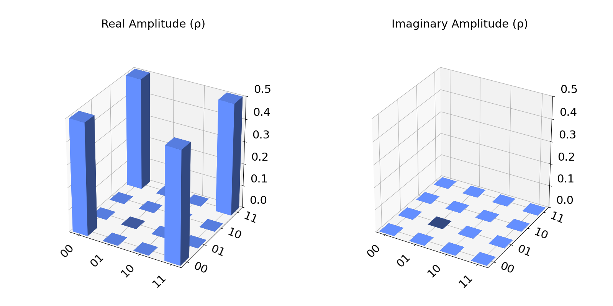

# Visualizations

## City

In order to display the histogram for our circuit in a 3D histogram, we only need to import the plot_state_city and provide the QuantumCircuit we want to visualize.  
We create a simple circuit:

```python  
from qiskit import QuantumCircuit
from qiskit_aer import AerSimulator

qc = QuantumCircuit(2, 2)
qc.h(0)
qc.cx(0, 1)
```


Now we generate the visualization for the circuit:

```python  
from qiskit.visualization import plot_state_city

plot_state_city(qc)
```
The statevector for this circuit is:  

$`\ket{\psi}=\frac{1}{\sqrt{2}}(\ket{00}+\ket{11})`$

And so the generated image is:




