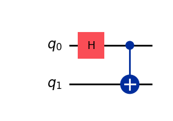
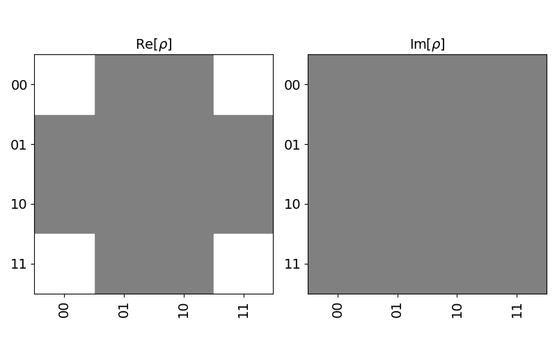
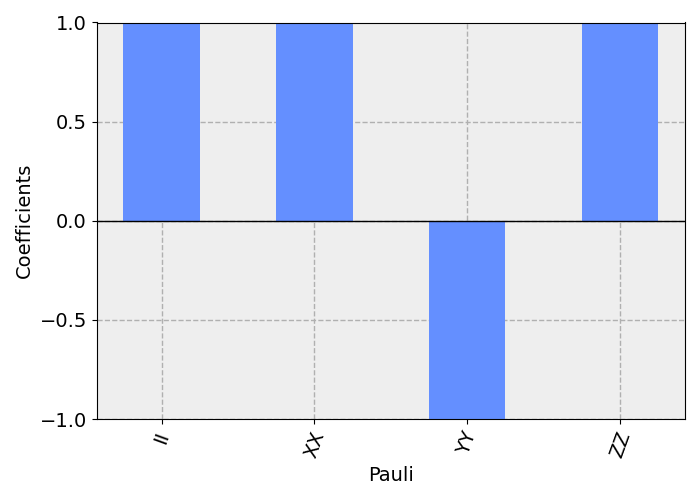

# Visualizations
In this page we are going to explore some of the available visualizations for Quantum circuits with Qiskit.
We will be using the same basic circuit for each of them:
```python  
from qiskit import QuantumCircuit
from qiskit_aer import AerSimulator

qc = QuantumCircuit(2, 2)
qc.h(0)
qc.cx(0, 1)
```
  

## City
In order to display the histogram for our circuit in a 3D histogram, we only need to import the plot_state_city and provide the QuantumCircuit we want to visualize.  
Now we generate the visualization for the circuit:
```python  
from qiskit.visualization import plot_state_city

plot_state_city(qc)
```
The statevector for this circuit is:  
$`\ket{\psi}=\frac{1}{\sqrt{2}}(\ket{00}+\ket{11})`$  
And so the generated image is:


## Hinton
Another visualization which is available is the Hinton one which uses a couple of grayed out squares instead of a 3D histogram. In this case, the values are represented using different shades of grey.
With this code:
```python  
from qiskit.visualization import plot_state_hinton

plot_state_hinton(qc)
```
The Hinton visualization would be:  
  

## Pauli
The required code is:
```python  
from qiskit.visualization import plot_state_paulivec

plot_state_paulivec(qc)
```
The Pauli visualization would be:  
  

## QSphere
The QSphere visualization shows the output from one circuit in the bloch sphere. 
Now the required code is this:
```python  
from qiskit.visualization import plot_state_qsphere

plot_state_qsphere(qc)
```
The QSphere visualization would be:  
  

# DAG (Directed Acyclic Graph)

DAG does not provide a way to display the expected output of a circuit but a way to display the circuit itself showing the dependencies in the circuit.
The diagram for our 'standard' circuit is:  
  


